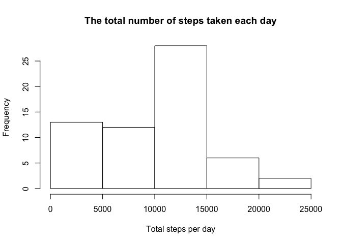
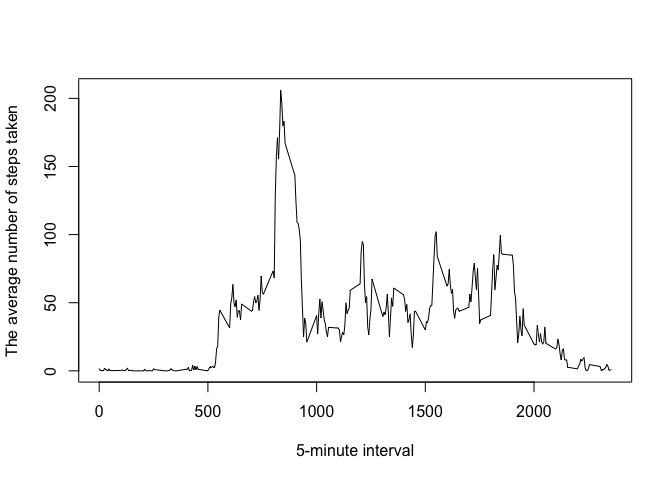
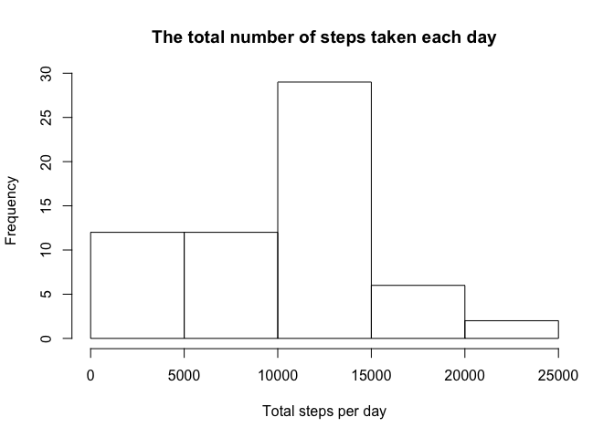
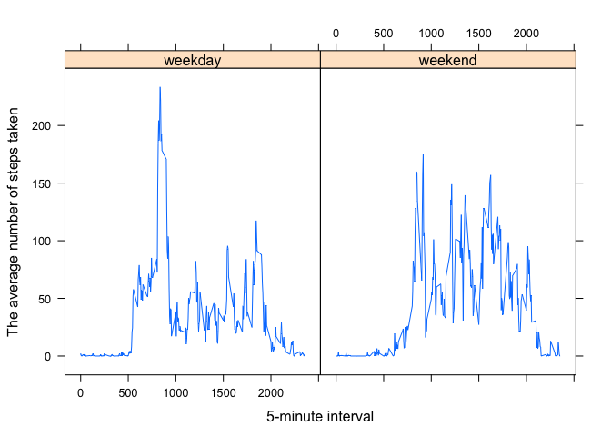

# Reproducible Research: Peer Assessment 1


## Loading and preprocessing the data

```r
unzip("activity.zip")
df <- read.csv("activity.csv", header=TRUE, stringsAsFactors = FALSE)
```

## What is mean total number of steps taken per day?

```r
library(dplyr)
df_by_date <- group_by(df,date)
df_total_steps <- summarise(df_by_date,total_steps=sum(steps,na.rm=TRUE))
hist(df_total_steps$total_steps,main="The total number of steps taken each day",xlab="Total steps per day")
```

 

```r
mean(df_total_steps$total_steps,na.rm=TRUE)
```

```
## [1] 9354.23
```

```r
median(df_total_steps$total_steps,na.rm=TRUE)
```

```
## [1] 10395
```

## What is the average daily activity pattern?

```r
df_by_interval <- group_by(df,interval)
df_mean_steps <- summarise(df_by_interval,mean_steps=mean(steps,na.rm=TRUE))
plot(df_mean_steps$interval,df_mean_steps$mean_steps,type="l", xlab="5-minute interval", ylab="The average number of steps taken")
```

 

```r
#Show 5-minute interval which contains the maximum number of steps
df_mean_steps[which(df_mean_steps$mean_steps==max(df_mean_steps $mean_steps)),][1]
```

```
## Source: local data frame [1 x 1]
## 
##   interval
## 1      835
```

## Imputing missing values

```r
#Calculate and report the total number of missing values in the dataset (i.e. the total number of rows with NAs)
nrow(df[is.na(df$steps),])
```

```
## [1] 2304
```

```r
#make a copy of an initial data frame zzz
df_nona <- df

#replacing NA for a given 5-minute interval with average steps for this interval from z data frame 
df_nona[is.na(df_nona$steps),1] <- df_mean_steps[which(df_mean_steps$interval==df_nona$interval),2]

df_nona_by_date <- group_by(df_nona,date)
df_nona_total_steps <- summarise(df_nona_by_date,total_steps=sum(steps,na.rm=TRUE))

#Make a histogram of the total number of steps taken each day 
hist(df_nona_total_steps$total_steps,main="The total number of steps taken each day",xlab="Total steps per day")
```

 

```r
mean(df_nona_total_steps$total_steps,na.rm=TRUE)
```

```
## [1] 9530.724
```

```r
median(df_nona_total_steps$total_steps,na.rm=TRUE)
```

```
## [1] 10439
```


## Are there differences in activity patterns between weekdays and weekends?

```r
#adding weekdays column
df_nona$weekdays <- weekdays(as.Date(df_nona$date))
#replacing weekdays names with weeked or weekday
df_nona[df_nona$weekdays=="Sunday",][4] <- "weekend"
df_nona[df_nona$weekdays == "Saturday",][4] <- "weekend"
df_nona[df_nona$weekdays != "weekend",][4] <- "weekday"
df_nona$weekdays <- as.factor(df_nona$weekdays)

library(lattice)
df_nona_by_interval <- group_by(df_nona,interval,weekdays)
df_nona_mean_steps <- summarise(df_nona_by_interval,mean_steps=mean(steps,na.rm=TRUE))
xyplot(mean_steps ~ interval | weekdays,data=df_nona_mean_steps,type="l", xlab="5-minute interval", ylab="The average number of steps taken")
```

 
